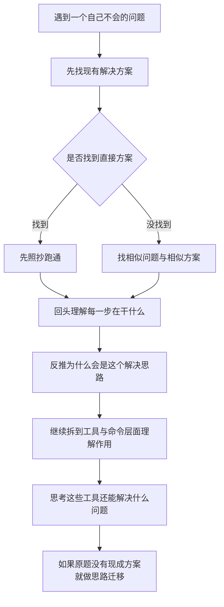

---
title: Linux教程系列
published: 2026-03-21
description: Linux 教程合集，智泽实验室系列。
tags: ["Linux", "教程", "智泽实验室"]
category: 教程
draft: false
---

这是智泽实验室的 Linux 教程合集。在开始学习前，建议先阅读下面的说明与要求。

## 学习说明

1. 所有章节都会留练习题，建议大家在评论区给出答案和思路，方便交流不同解法。
2. 推荐使用 WSL2 的 Ubuntu 22.04，或实验室服务器中的 Ubuntu 环境进行实践。
3. 本合集要求独立完成练习，不使用 ChatGPT、Gemini、Claude Code、Codex 等 AIGC 或智能体代码工具。
4. 遇到问题请先自行使用搜索引擎检索；如果问题较复杂或存在争议，回答时请附上参考信息。

## 预习视频

在正式开始章节学习前，请先根据下面的视频把 WSL 环境准备好：

<div style="position: relative; width: 100%; padding-top: 56.25%; margin: 1.5rem 0;">
  <iframe
    src="https://player.bilibili.com/player.html?bvid=BV1tW42197za&page=1&high_quality=1&danmaku=0&autoplay=0"
    loading="lazy"
    scrolling="no"
    border="0"
    frameborder="no"
    framespacing="0"
    allowfullscreen="true"
    style="position: absolute; inset: 0; width: 100%; height: 100%; border: 0; border-radius: 0.75rem;"
  ></iframe>
</div>

## 章节目录

- [0.Linux教程作答看板](/posts/linux-tutorial-series/0-answer-board/)
- [1.基础Shell指令](/posts/linux-tutorial-series/1-basic-shell-commands/)
- [1.基础Shell指令-2](/posts/linux-tutorial-series/1-basic-shell-commands-2/)
- [3.Linux分区与硬盘查看](/posts/linux-tutorial-series/3-linux-disk-partitions/)
- [4.压缩与进程管理](/posts/linux-tutorial-series/4-compress-process/)
- [5.Linux网络基础与排查](/posts/linux-tutorial-series/5-network-basics/)

## 学习目标

我希望看到的：

- 大家在学完之后，能够在较短时间内写出满足要求的命令。
- 不仅会“敲命令”，也能解释命令的作用、参数含义和适用场景。

我不希望看到的：

- 依赖 Codex、Claude Code 等工具直接生成答案后提交。
- 把时间花在组织提示词上，而不是自己动手练习和排查问题。

## 最后

祝大家学得轻松，也学得扎实。Linux 在嵌入式、深度学习、边缘端和服务器环境里都很常见，基础打牢之后，后面的很多内容都会顺很多。

## 2026年4月补充

考虑到大家刚入门 Linux 时，上网找资料常常会觉得很杂，不知道从哪里入手，我把自己平时更常用的一套“学习工具范式”整理一下。这里说的不是学理论，而是你遇到一个不会的问题时，应该怎么把它拆开、跑通、理解、迁移。

### 学习工具范式图



### 这套范式对应的实际步骤

1. 遇到自己不会的问题，先去找现有解决方案。
2. 如果有现成方案，先照着跑，当前阶段先以“能不能解决问题”为第一目标。
3. 如果没有直接方案，就去找相似问题，把相似问题的解决方案先找出来并跑通。
4. 问题解决之后，再回过头看解决步骤；如果每一步你都说不清在干什么，就继续理解。
5. 在理解完步骤之后，再去想：为什么这个问题会对应这样的解决思路，而不是别的思路？
6. 再继续细化到工具层面，理解这里为什么用了这个命令、这个配置、这个文件。
7. 最后再想一层：这些工具除了能解决当前问题，还能解决哪些类似问题；如果原问题没有现成答案，这时候你就可以开始做思路迁移。

### 举例问题

装了 conda 环境，但是就是用不了，出不来 `(base)`。

下面按这套思路，把这个问题完整走一遍。

#### 第一步：先找现有解决方案

这时候先不要急着自己瞎试。先去搜类似关键词，例如：

- `conda base not showing`
- `conda activate base not working`
- `conda init bash`
- `conda command not found after install`

你通常会看到几类高频方案：

- 执行 `conda init bash`
- 重新加载 shell 配置，例如 `source ~/.bashrc`
- 手动 `source` conda 的初始化脚本
- 确认当前 shell 类型是不是 `bash` / `zsh`

#### 第二步：先照抄，把问题跑通

如果你当前用的是 `bash`，可以先按最常见的方案直接试：

```bash
which conda
echo $SHELL
conda init bash
source ~/.bashrc
conda activate base
```

如果 `conda` 命令本身都还调用不起来，再尝试手动加载初始化脚本：

```bash
source ~/miniconda3/etc/profile.d/conda.sh
conda activate base
```

这一步的目标不是“完全理解 conda 的机制”，而是先确认问题是否已经被解决。

#### 第三步：回头理解每一步在干什么

如果上面的命令跑通了，这时候不要停。

- `which conda`
  用来确认系统当前到底能不能找到 `conda` 命令。
- `echo $SHELL`
  用来确认你当前到底在用什么 shell。
- `conda init bash`
  会往 `~/.bashrc` 里写入 conda 的初始化逻辑。
- `source ~/.bashrc`
  是让你当前这个 shell 立刻重新加载配置，而不是等下次重新开终端。
- `conda activate base`
  不是“普通命令调用”，它依赖 shell 先加载 conda 的 hook。

如果你前面只是照抄，这一步才开始真正建立理解。

#### 第四步：反推为什么会是这个解决思路

这时你应该去想：

为什么这类问题的解决思路常常不是“重装 conda”，而是“初始化 shell”？

因为这个问题往往不是 conda 本体坏了，而是：

- shell 没有加载 conda 的初始化脚本
- `conda` 命令虽然在，但 `activate` 机制没有接进当前 shell
- 配置文件没有写入，或者写入后没有重新加载

也就是说，问题的根因通常不在“环境不存在”，而在“shell 与 conda 没接好”。

#### 第五步：继续拆到工具/命令层面理解

接下来要继续问：

- `~/.bashrc` 是什么，为什么 conda 要改它？
- `source` 到底做了什么，为什么不用重新登录也能生效？
- shell hook 是什么，为什么 `conda activate` 需要它？
- `bash`、`zsh`、`fish` 的初始化方式为什么不一样？

这一步是在把“会修问题”继续推进到“会解释问题”。

#### 第六步：思考这些工具还能解决什么问题

当你理解了 `conda init`、`source`、shell 配置文件之后，你会发现这套知识不只解决这一个问题。

例如：

- `zsh` 里 conda 不生效，思路类似，只是改成 `conda init zsh`
- 某些命令装了以后“下次开终端能用，这次不能用”，本质也是配置未重新加载
- `nvm`、`pyenv`、`cargo`、用户自定义脚本不生效，很多时候也和 PATH 或 shell 初始化有关

也就是说，你学到的不是一个 conda 小技巧，而是一套“命令行工具如何接入 shell”的通用理解。

#### 第七步：如果一开始没有现成方案，就做思路迁移

假设你搜不到“完全一样的问题”，比如：

- 你用的是比较少见的 shell
- 你的 conda 安装路径和别人不一样
- 你是在远程服务器、多层 SSH、tmux/screen 环境里遇到问题

那你就可以把前面已经理解的思路迁移过去：

1. 先确认 `conda` 命令是否存在。
2. 再确认当前 shell 类型。
3. 再确认初始化脚本是否被写进对应配置文件。
4. 再确认当前 shell 会不会主动读取这个配置文件。
5. 最后决定是修改配置、手动 `source`，还是换成对应 shell 的初始化方式。

这时候你已经不再是“等别人给你同款答案”，而是能靠理解自己把问题拆开，拥有自己的解决思路了。
