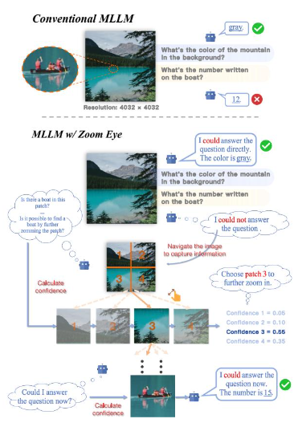

# 论文链接: [ZoomEye: Enhancing Multimodal LLMs with Human-Like Zooming  Capabilities through Tree-Based Image Exploration](https://aclanthology.org/2025.emnlp-main.335/)

这个论文的题目就很生动形象，Zoom表示缩放的意思，尤其是你用镜头去拍物体的时候，会涉及频繁的缩放动作，Eye则是以人眼的工作模式进行视觉处理。

## 动机 Motivation

这篇文章刚出的时候，恰好是[Deepseek R1](https://arxiv.org/abs/2501.12948)的reasoning内篇论文发出来没多久，所以多模态做的很少。

现有的工作都是在语义层级上去做工作，既然要放到多模态模型，那必然就要动视觉输入了。观察一个现象就可以发现，对于高分辨率下的 **小物体**，如果我们直接输入到模型，问一些小物体的细节，模型就会回答出现偏差，原因是 **?** ,所以得想办法在图像层面上做reasoning。

## 观察 Observation

人眼去观察物体的时候，如果因为物体过小导致没有办法看清，那么就会 **凑近**去看，而且并不会同步观察全局的视野，而是选择性的观察感兴趣的地方。

如果人眼去寻找物体的时候，这个物体通常在人的认知里会有一个先验知识: 牙刷大概率出现在洗漱台，眼镜找不到了会优先去眼镜盒里翻，要找证件的话会先去钱包/证件包里找...... 这些先验知识也就可以帮助人们快速找到**感兴趣**的地方。

## 提出与贡献 Contribution

所以本篇论文基于上述动机和观察就提出了[ZoomEye](https://github.com/om-ai-lab/ZoomEye)：

1. we propose Zoom Eye, a tree search algorithm for vision-level reasoning, which navigates MLLMs in the dense image context by the hierarchical and visual nature of images (contribution #1).
2. Equipped with Zoom Eye, all evaluated models achieve substantial performance improvements compared to the baseline (contribution #2).
3. our analysis reveals certain deficiencies in visual understanding exhibited by these models, which we detail in §4.3 (contribution #3).
4. More importantly, as discussed in §4.4.1, we observe a vision-level test-time scaling phenomenon analogous to what has been observed in text-based LLMs: performance consistently improves with an increasing number of search steps. This finding suggests that vision-level reasoning benefits from deeper exploratory search and opens new avenues for scaling MLLM inference beyond static image perception (contribution #4).

其实就是学习人眼的工作原理去做视觉输入的调整进而达到好的效果。同时本篇论文也发现了一个属于视觉领域的scaling phenomenon: 随着我们渐进的去调整视觉输入，模型的视觉能力也会随之受益。

## 方法 Method

本文方法把 **Zoom**的过程抽象为了搜索过程，所以使用了树(Tree)的数据结构去抽象构建方法。同样的，使用DFS方法去做搜索。

我们现在有原始视觉输入，原始文本提示词（通常是问题）输入。

搜索前需要明确目的，根据文本提示词输入去提炼（语义分析），找到关键视觉线索。利用基座模型的上下文学习（[In-Context Learning](https://arxiv.org/abs/2005.14165)）能力，套用设计的提示词模板，进而引导模型去推导视觉线索应该对应寻找的实体，对应自动输出 $k$ 个与问题高度相关的视觉线索集合 $\{o_1, \dots, o_k\}$， $k$ 是可变的，然后再根据线索往下推理。

有了线索了，就可以开始构建树，用DFS算法去做搜索了。

1. 既然抽象成树了，树节点怎么创建的：

   树节点做成 $ \{I, b_t \} $，$I$是图像，$ b_t $是 边界框的信息（切分后在原始图像的位置）。

   对于根节点，则做成 $ \{I, (0, 0, 1, 1) \} $ 对应输入图像。

2. 树节点怎么连接起来的：如果 父节点$ I $的图像分辨率超过指定的预设值了，则把他们切成四个尺寸一样的块，这四个块视为父节点下的字节点，子节点再根据图像分辨率情况考虑是否切分，进而再次生成子节点。

3. 如何给树节点做排序，进而加快搜索速度：根据前文给定的视觉线索集合 $ o $ ，当当前节点存在对应的线索时或者当前节点可以被察觉到有线索但是需要进一步zoom的时候，我们给树节点赋予更高的搜索权重，伪代码见：

$$\begin{array}{l} \textbf{Algorithm 2: Ranking Function \& Stopping Criterion} \\ \hline \textbf{Require: } \Phi_{\theta}, \mathcal{V}, \{p_{c}, p_{l}, p_{a}\}, \tau, o, q_{s} \\ \hline 1:\quad \textbf{function } \mathcal{R}(n_{1}, n_{2}) \quad \triangleright \text{Ranking Function} \\ 2:\quad\quad \textbf{return } \text{GET\_PRIORITY}(n_{1}) > \text{GET\_PRIORITY}(n_{2}) \\ 3: \\ 4:\quad \textbf{function } \mathcal{S}(n_{t}) \quad \triangleright \text{Stopping Criterion} \\ 5:\quad\quad c_{a} \leftarrow \text{LOGITS\_RATIO}(n_{t}, p_{a}(q_{s})) \\ 6:\quad\quad \textbf{return } c_{a} \ge \tau \\ 7: \\ 8:\quad \textbf{function } \text{GET\_PRIORITY}(n_{t}) \\ 9:\quad\quad \textbf{if } n_{t}.\text{priority is None then} \\ 10:\quad\quad\quad c_{e} \leftarrow \text{LOGITS\_RATIO}(n_{t}, p_{c}(o)) \\ 11:\quad\quad\quad c_{l} \leftarrow \text{LOGITS\_RATIO}(n_{t}, p_{l}(o)) \\ 12:\quad\quad\quad \alpha \leftarrow \mathcal{W}(n_{t}.\text{depth}) \quad \triangleright \text{weighted factor} \\ 13:\quad\quad\quad n_{t}.\text{priority} \leftarrow \alpha \cdot c_{l} + (1 - \alpha) \cdot c_{e} \\ 14:\quad\quad \textbf{return } n_{t}.\text{priority} \\ 15: \\ 16:\quad \textbf{function } \text{LOGITS\_RATIO}(n_{t}, x) \\ 17:\quad\quad z_{1} \leftarrow \Phi_{\theta}(y = \text{Yes} \mid \mathcal{V}(n_{t}), x) \\ 18:\quad\quad z_{2} \leftarrow \Phi_{\theta}(y = \text{No} \mid \mathcal{V}(n_{t}), x) \\ 19:\quad\quad z \leftarrow (\text{softmax}(z_{1}, z_{2})[0] - 0.5) \times 2 \quad \triangleright z \in (-1, 1) \\ 20:\quad\quad \textbf{return } z \\ \hline \end{array}$$

4. 搜索的停止条件：

   根据给定的问题模板去询问当前是否可以回答原始问题了，如果回答的置信度超过了设定的阈值了，则采纳并停止搜索

## 实验部分 Experiments

在 [${V}^* $](https://arxiv.org/abs/2312.14135), [HR-bench 4K](https://arxiv.org/abs/2408.15556), [HR-bench 8K](https://arxiv.org/abs/2408.15556), [MME-RealWorld](https://arxiv.org/abs/2408.13257)数据集上进行实验。
使用3B-8B参数量的模型进行评测，评测指标为准确性(Accurancy)。

### 各模型在高分辨率基准上的性能评测

$V^*$ Bench：包含针对微小目标的属性识别（Attr，Attribute Recognition）和空间关系推理（Spatial Reasoning），以及该数据集的综合得分（Overall）。

HR-Bench（4K 与 8K 分辨率）：细分为精细单实例感知（FSP，Fine-grained Single-instance Perception，如识别单个微小物件的文字或颜色）与精细跨实例感知（FCP，Fine-grained Cross-instance Perception，如比较多个细小目标之间的相对关系），同样包含各自的综合得分（Overall）。

:::div{.katex-table-scroll tabindex="0" role="region" aria-label="各模型在高分辨率基准上的性能评测"}

$$
\begin{array}{lccccccccc}
\hline
\text{Model} & \text{V}^*\text{-Attr} & \text{V}^*\text{-Spat} & \text{V}^*\text{-Over} & \text{4K-FSP} & \text{4K-FCP} & \text{4K-Over} & \text{8K-FSP} & \text{8K-FCP} & \text{8K-Over} \\
\hline
\text{minigptv2-7B} & - & - & - & 25.75 & 25.25 & 25.50 & 26.00 & 26.25 & 26.13 \\
\text{LLaVA-v1.6-7B} & 60.87 & 63.16 & 61.78 & 49.00 & 46.75 & 47.88 & 37.25 & 44.25 & 40.75 \\
\text{LLaVA-v1.6-13B} & 60.00 & 64.47 & 61.78 & 49.75 & 41.25 & 45.50 & 38.00 & 38.25 & 38.13 \\
\text{Yi-VL-34B} & 51.30 & 64.47 & 56.54 & 46.00 & 42.75 & 44.38 & 39.50 & 38.50 & 39.00 \\
\text{LLaVA-HR-X-7B} & - & - & - & 57.75 & 46.25 & 52.00 & 42.00 & 41.25 & 41.63 \\
\hline
\text{Qwen-VL-max} & - & - & 66.00 & 65.00 & 52.00 & 58.50 & 54.00 & 51.00 & 52.50 \\
\text{GPT-4o} & - & - & - & 70.00 & 48.00 & 59.00 & 62.00 & 49.00 & 55.50 \\
\hline
\text{LLaVA-v1.5-7B} & 43.47 & 56.57 & 48.68 & 38.50 & 33.75 & 36.13 & 33.00 & 31.25 & 32.13 \\
\text{w/ Zoom Eye} & 83.45 & 82.89 & 83.25 & 67.75 & 38.75 & 53.25 & 65.50 & 36.00 & 50.75 \\
\Delta & +40.48 & +26.32 & +34.57 & +29.25 & +5.00 & +17.12 & +32.50 & +4.75 & +18.62 \\
\text{Qwen2.5VL-3B} & 80.87 & 71.05 & 76.96 & 82.75 & 49.00 & 65.88 & 80.50 & 45.25 & 62.88 \\
\text{w/ Zoom Eye} & 88.70 & 89.47 & 89.01 & 86.75 & 53.50 & 70.13 & 84.75 & 52.00 & 68.38 \\
\Delta & +7.83 & +18.42 & +12.05 & +4.00 & +4.50 & +4.25 & +4.25 & +6.75 & +5.50 \\
\text{LLaVA-ov-7B} & 75.65 & 75.00 & 75.39 & 72.00 & 54.00 & 63.00 & 67.25 & 52.25 & 59.75 \\
\text{w/ Zoom Eye} & 93.91 & 85.53 & 90.58 & 84.25 & 55.00 & 69.63 & 88.50 & 50.00 & 69.25 \\
\Delta & +18.26 & +10.53 & +14.19 & +12.25 & +1.00 & +6.63 & +21.25 & -2.25 & +10.00 \\
\text{InternVL2.5-8B} & 67.83 & 71.05 & 69.11 & 75.75 & 56.25 & 66.00 & 61.50 & 53.25 & 57.38 \\
\text{w/ Zoom Eye} & 86.09 & 82.89 & 84.82 & 88.75 & 61.50 & 75.13 & 89.75 & 57.50 & 73.63 \\
\Delta & +18.26 & +11.84 & +15.71 & +13.00 & +5.25 & +9.13 & +28.25 & +4.25 & +16.25 \\
\hline
\end{array}
$$

:::

---

### [MME-RealWorld](https://arxiv.org/abs/2408.13257) 真实世界基准测试对比
MO(Monitoring):涵盖数量计算（Calculate）、行为意图理解（Intention）、物体固有属性（Property）、朝向判断（Orientation）以及外观颜色（Color，由车辆颜色与行人颜色等多项类似子任务平均计算得出）

AD(Autonomous Driving):考察对交通参与者意图的判断（Intention）、关键信号灯注意力分配（Attention）以及物体动态运动状态（Motion）。

RS(Remote Sensing):主要测试大范围俯视图下的地物计数（Count）以及全局空间位置定位（Position）。

:::div{.katex-table-scroll tabindex="0" role="region" aria-label="MME-RealWorld 真实世界基准测试对比"}

$$
\begin{array}{lcccccccccc}
\hline
\text{Method} & \text{MO-Calc} & \text{MO-Int} & \text{MO-Prop} & \text{MO-Ori} & \text{MO-Color} & \text{AD-Int} & \text{AD-Attn} & \text{AD-Mot} & \text{RS-Count} & \text{RS-Pos} \\
\hline
\text{LLaVA-ov-7B} & 36.33 & 27.55 & 55.00 & 14.94 & 34.19 & 37.32 & 71.89 & 30.61 & 32.95 & 61.40 \\
\text{w/ Zoom Eye} & 38.67 & 38.78 & 60.00 & 14.62 & 47.09 & 38.56 & 68.66 & 42.71 & 35.56 & 48.45 \\
\Delta & +2.34 & +11.23 & +5.00 & -0.32 & +12.90 & +1.24 & -3.23 & +12.10 & +2.61 & -12.95 \\
\hline
\end{array}
$$

:::
